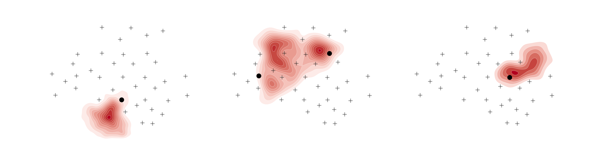

# scr-stan: spatial capture-recapture examples in Stan

<!-- badges: start -->

<!-- badges: end -->

The goal of scr-stan is to provide Stan implementations for a variety of 
spatial capture-recapture models described in the book 
[Spatial Capture-Recapture](https://www.elsevier.com/books/spatial-capture-recapture/royle/978-0-12-405939-9)
by Royle, Chandler, Gardner, and Sollmann.
The emphasis is on translating models from [JAGS](http://mcmc-jags.sourceforge.net/) to [Stan](https://mc-stan.org/). 

### Why?

Stan is a flexible language that enables full Bayesian inference with dynamic
Hamiltonian Monte Carlo, approximate Bayesian inference with automatic
differentiation variational inference, and optimization (e.g., penalized 
maximum likelihood).

There are some good reasons to use Stan: 

- Stan is fast
- Stan has good [documentation](https://mc-stan.org/users/documentation/)
- Stan helps you avoid errors with [data types](https://mc-stan.org/docs/2_23/reference-manual/univariate-data-types-and-variable-declarations.html)
- Stan has good [sampling diagnostics and warnings](https://mc-stan.org/misc/warnings.html)
- Stan has a healthy [user community](https://discourse.mc-stan.org/)

Using Stan can be hard for ecologists with experience in JAGS/BUGS/NIMBLE, because 
[you have to marginalize over discrete parameters](https://mc-stan.org/docs/2_23/stan-users-guide/latent-discrete-parameterization.html). 
But, you don't have to start from scratch. 

Hopefully these Stan implementations lower the barrier to entry.

### Dependencies

These examples use the `scrbook` R package, which you can download from here: 
https://sites.google.com/site/spatialcapturerecapture/scrbook-r-package

The remaining dependencies are on CRAN, and you can install them from R with:

```r
devtools::install_deps()
```

### What's here

This repo contains a bunch of Stan translations of JAGS models provided in the
SCR book. 
Each example is a self-contained R script, and one or two Stan files.

- [Chapter 5: fully spatial capture-recapture models](ch05)
- [Chapter 6: likelihood analysis of spatial capture-recapture models](ch06)
- [Chapter 7: variation in encounter probability](ch07)
- [Chapter 8: model selection and assessment](ch08)
- [Chapter 9: alternative observation models](ch09)
- [Chapter 11: spatial variation in density](ch11)
- [Chapter 14: stratified populations: multi-session and multi-site data](ch14)
- [Chapter 15: models for search-encounter data](ch15)
- [Chapter 16: open population models](ch16)

### Inspiration

This repo was built in the spirit of the Hiroki Itô's excellent [Stan 
translations of "Bayesian Population Analysis using 
WinBUGS --- A Hierarchical Perspective" (2012) by Marc Kéry and Michael Schaub](https://github.com/stan-dev/example-models/tree/master/BPA).

### Contributing

If you have questions or find any issues, feel free to open an issue on GitHub: 
https://github.com/mbjoseph/scr-stan/issues

